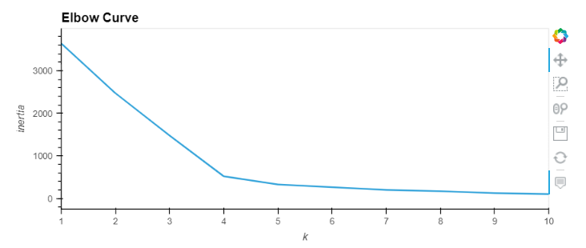
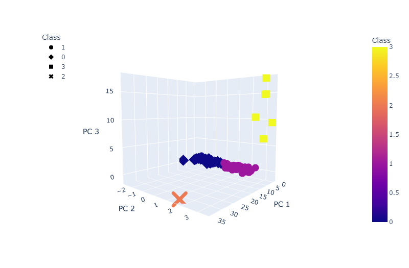
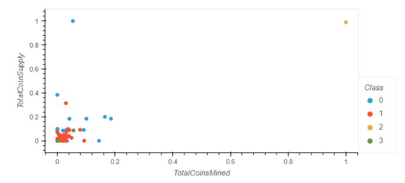

# Module 18 Challenge - Cryptocurrencies

In this module we were asked to use our understanding of unsupervised learning to process cryptocurrancy data and reduce the dimensions using PCA. This data will then be used t assist clients as they prepare to enter and invest into the cryptocurrancy market. 

In the first two sections, we work to prepare the data by cleaning and binarize variables and then reducing the data dimensions using PCA. In serction 3, we use K-means clustering with 4 groups (after running the elbow curve below). Finally, in the final section we visualize the results of the clustering using a 3D model and the PCA variables, and a 2D model with the supply and number of mined coins for each cryptocurrancy type. 

